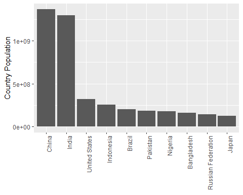
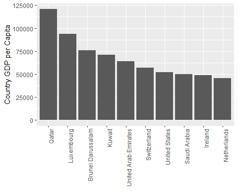
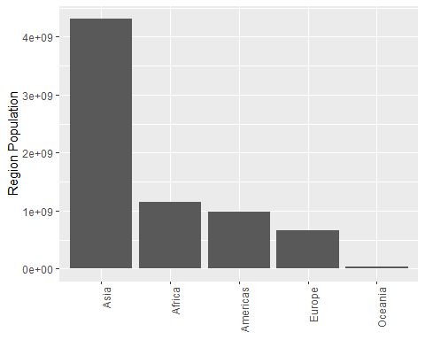
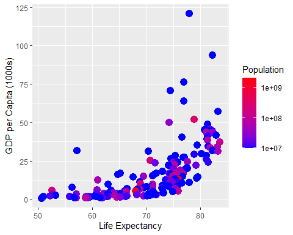
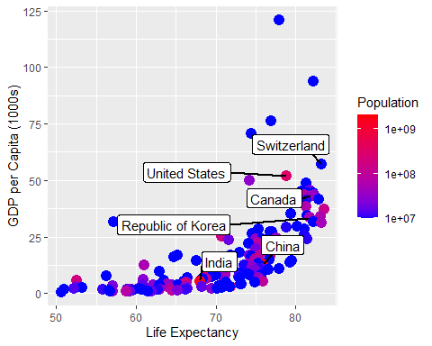

Geospatial Analysis and Visualization in R
================
Tyler Hampton

- [GIS with R Tutorial -
  PREREQUISITES](#gis-with-r-tutorial---prerequisites)
  - [Adjust Settings, Load Packages](#adjust-settings-load-packages)
- [Section 1: Basic principles](#section-1-basic-principles)
  - [Review of the pipe](#review-of-the-pipe)
  - [Review of ggplot](#review-of-ggplot)
  - [Review of aggregate](#review-of-aggregate)
  - [Apply Aggregate to Population
    Data](#apply-aggregate-to-population-data)
    - [More Practice with ggplot](#more-practice-with-ggplot)

# GIS with R Tutorial - PREREQUISITES

This document will provide an overview of a few important components of
this GIS workshop. This document will not use any GIS functions or
operations, but it will be based on a summary statistic dataset of world
countries, that comes in the form of a geospatial object.

Key functions for you to know:

- ggplot2
- aggregate
- “the pipe”
- left_join

P.S. This document was generated using R Markdown. This is a great tool
for code transparency and data analysis, because the code blocks, code
outputs, and your comments are “knitted” into a single document! Ask us
more about this

## Adjust Settings, Load Packages

In order to equip R with functionality for gis data, we need to load or
install several packages. Because this is an intermediate+ workshop, I
have code written in sometimes complicated formats, but I will do my
best to explain what I am doing. There are many ways to do the same
thing in R. Similarly, there are many different packages in R that can
handle the same types of data. We will use the pairing of the *ggplot2*
and *sf* packages. We’ll load several other packages we’ll use. In
particular, the *spData* package contains lots of open-source geospatial
data that we can use! For the most current version, we need to access
the github code repository for *spDataLarge*. A list of data is here:
<https://cran.r-project.org/web/packages/spData/spData.pdf>

``` r
#this is a custom function that that can load multiple packages at once
loadpackages=function(packages){  for(p in packages){
  if(!require(p,character.only=T)){install.packages(p)}
  # IF require returns FALSE, the package is missing and will be installed
  library(p,character.only=T,quietly=T,verbose=F)}} # next, it calls the package with library

loadpackages(c(
           "devtools","data.table","ggplot2","sf",
           "ggrepel",
           "plyr", #the split-apply-combine paradigm
           "dplyr", # a grammar of data manipulation
           "spData" # Spatial Datasets
           ))
```

# Section 1: Basic principles

We’ll start this tutorial with a dataset that should look familiar:
borders of the World’s countries.

From the start, let’s examine some of the open-source geospatial data
that comes with the *spData* package.

The *world* dataset contains shapefiles for 177 countries. We can take
*dim* of *world* to see that like a data frame, it contains data in 177
rows, and has 11 columns. *names* of *world* tells us there are
attributes for each shape such as name, which we would expect, some
regional data, and demographics, including population, life expectancy,
and gross domestic product per capita. Finally, the column **geom**
contains the information that makes this object different than just a
regular data frame.

``` r
data("world")
dim(world) # take the 'dimensions' of the object, returns rows and columns
```

    ## [1] 177  11

``` r
names(world) # gives column names of object
```

    ##  [1] "iso_a2"    "name_long" "continent" "region_un" "subregion" "type"     
    ##  [7] "area_km2"  "pop"       "lifeExp"   "gdpPercap" "geom"

When we call for *head* of *world*, we can see data for several
countries in Africa and North America. We also see an interesting series
of 6 lines printed ahead of what looks like a regular data frame. We see
that *head* has returned what it calls a “Simple feature collection with
6 features and 10 fields”. Note, it considers the 10 fields as the 11
columns but minus the geom column. We can also see a *bbox* field
defining the geographic extent of the data, and the final two lines
showing us data on the data *projection*. We’ll come to projections in a
moment.

``` r
head(world) # return top 6 items/rows of an object
```

    ## Simple feature collection with 6 features and 10 fields
    ## Geometry type: MULTIPOLYGON
    ## Dimension:     XY
    ## Bounding box:  xmin: -180 ymin: -18.28799 xmax: 180 ymax: 83.23324
    ## Geodetic CRS:  WGS 84
    ## # A tibble: 6 × 11
    ##   iso_a2 name_long  continent region_un subregion type  area_km2     pop lifeExp
    ##   <chr>  <chr>      <chr>     <chr>     <chr>     <chr>    <dbl>   <dbl>   <dbl>
    ## 1 FJ     Fiji       Oceania   Oceania   Melanesia Sove…   1.93e4  8.86e5    70.0
    ## 2 TZ     Tanzania   Africa    Africa    Eastern … Sove…   9.33e5  5.22e7    64.2
    ## 3 EH     Western S… Africa    Africa    Northern… Inde…   9.63e4 NA         NA  
    ## 4 CA     Canada     North Am… Americas  Northern… Sove…   1.00e7  3.55e7    82.0
    ## 5 US     United St… North Am… Americas  Northern… Coun…   9.51e6  3.19e8    78.8
    ## 6 KZ     Kazakhstan Asia      Asia      Central … Sove…   2.73e6  1.73e7    71.6
    ## # ℹ 2 more variables: gdpPercap <dbl>, geom <MULTIPOLYGON [°]>

## Review of the pipe

The pipe (%\>%) is an operator intruduced by dplyr that facilitates
left-to-right coding instead of inside-out coding. We’ll use the pipe
extensively in this workshop. The following example shows that to get
the same result, we can code the process two different ways.

``` r
a=rnorm(n=10,mean=-2,sd=3) # normal distribution with a mean of -2 and standard 
                           #  deviation of 3
a
```

    ##  [1] -2.780616 -3.960254 -3.508793 -3.849133 -3.531378 -4.743260  2.171871
    ##  [8] -2.763118 -3.015994 -4.923277

``` r
round(abs(mean(a)),2)
```

    ## [1] 3.09

``` r
a %>% mean() # mean of a
```

    ## [1] -3.090395

``` r
a %>% mean() %>% abs() # absolute value OF the mean of a
```

    ## [1] 3.090395

``` r
a %>% mean() %>% abs() %>% round(.,2) # rounded absolute value OF the mean of a
```

    ## [1] 3.09

Our order of operations is, take the mean of a, then absolute value, and
round to two decimals. Read inside-out, the final function must be on
the inside and progress inside. Using the pipe, we can “pass” a to the
mean function, and the next pipe “passes” the **output** of that
function to the next. Where round() requires an input number *and* a
decimal specification, we use the period (.) as a placeholder.

## Review of ggplot

Let’s apply the pipe in an example to modify the “world” object.

``` r
worlddata <- data.table::setorder(subset(as.data.frame(world),select=-c(geom)),-"pop",na.last=T)

#now achieve the same outcome but using the pipe:
worlddata=world %>%
  as.data.frame() %>%
  subset(.,select=-c(geom)) %>%
  data.table::setorder(.,-"pop",na.last=T)
# sort by population, remove NAs, "-" implies decreasing
```

We have now stripped away the geospatial data, and are left with the
country statistics.

Remember that ggplots generally follow the pattern of a function call
(e.g. ggplot()) followed by sequential modifying functions separated by
the “+” sign.

``` r
ggplot(worlddata[1:10,])+  # specify the input dataframe here, and take the first 10 rows
  geom_col(        # geom_col produces a bar chart
    aes(x=factor(name_long,levels=name_long),
        # ggplot's default is to sort the x axis alphabetically, unless you sort by a factor
        y=pop) # set aesthetics, x and y variables
    )+  
  ylab("Country Population")+ # y axis label
  theme(
    axis.text.x=element_text(angle=90,hjust = 1), # rotate x axis text by 90 degrees
    axis.title.x=element_blank()) # remove x axis title
```

<!-- -->

We see that the world data comes with population as an attribute, and
this shows that China and India have exceeded 1 Billion people, while
the United States lags behind as the third most populated country in the
world.

Challenge: Create the following plot

``` r
ggplot(setorder(worlddata,-gdpPercap,na.last = T)[1:10,])+  
  # specify the input dataframe here, and take the first 10 rows
  geom_col(        # geom_col produces a bar chart
    aes(x=factor(name_long,levels=name_long),
        # ggplot's default is to sort the x axis alphabetically, unless you sort by a factor
        y=gdpPercap) # set aesthetics, x and y variables
    )+  
  ylab("Country GDP per Capita")+ # y axis label
  theme(
    axis.text.x=element_text(angle=90,hjust = 1), # rotate x axis text by 90 degrees
    axis.title.x=element_blank()) # remove x axis title
```

<!-- -->

## Review of aggregate

Explore the aggregate function using the *help* function.

``` r
#?stats::aggregate
# Example from the Help File
testDF <- data.frame(v1 = c(1,3,5,7,8,3,5,NA,4,5,7,9),
                     v2 = c(11,33,55,77,88,33,55,NA,44,55,77,99) )
by1 <- c("red", "blue", 1, 2, NA, "big", 1, 2, "red", 1, NA, 12)
by2 <- c("wet", "dry", 99, 95, NA, "damp", 95, 99, "red", 99, NA, NA)
aggregate(x = testDF, by = list(by1), FUN = "mean")
```

    ##   Group.1  v1   v2
    ## 1       1 5.0 55.0
    ## 2      12 9.0 99.0
    ## 3       2  NA   NA
    ## 4     big 3.0 33.0
    ## 5    blue 3.0 33.0
    ## 6     red 2.5 27.5

``` r
aggregate(x = testDF, by = list(by1, by2), FUN = "mean")
```

    ##   Group.1 Group.2 v1 v2
    ## 1       1      95  5 55
    ## 2       2      95  7 77
    ## 3       1      99  5 55
    ## 4       2      99 NA NA
    ## 5     big    damp  3 33
    ## 6    blue     dry  3 33
    ## 7     red     red  4 44
    ## 8     red     wet  1 11

## Apply Aggregate to Population Data

Let’s practice the use of this tool in extracting summary statistics
from the countries shapefile.

``` r
worlddata2=world %>% 
  as.data.frame() %>% # remove shapefile attributes, convert to dataframe
  subset(select=c(pop)) %>% # extract the population column
  aggregate(x = .,by=list(world$region_un),FUN=sum,na.rm=TRUE) %>% # sum by region
  data.table::setorder(.,-"pop") # sort by pop, decreasing

ggplot(worlddata2[1:5,])+
  geom_col(aes(x=factor(Group.1,levels=Group.1),y=pop))+
  ylab("Region Population")+
  theme(axis.text.x=element_text(angle=90,hjust = 1),axis.title.x=element_blank())
```

<!-- --> Here, we see that by region, Asia
has by far the largest summed population, with Africa exceeding the
Americas.

### More Practice with ggplot

Challenge: Create the following plot

``` r
ggplot(worlddata)+
  geom_point(aes(x=lifeExp,y=gdpPercap/1000,col=log10(pop)),size=4)+  
  scale_color_gradientn(
    name="Population",
    colors=c("blue","red"), # two end members of color gradient
    limits=c(7,9.3), # max and min of scale
    breaks=7:9, # breaks values for the plot legend
    labels=10^c(7:9), # show labels as 10 to the power of 7 through 9
    na.value="blue" # color for values outside limits()
  )+
  ylab("GDP per Capita (1000s)")+xlab("Life Expectancy")
```

<!-- -->

Challenge: Create the following plot

``` r
ggplot(data=worlddata)+
  geom_point(aes(x=lifeExp,y=gdpPercap/1000,col=log10(pop)),size=4)+  
  scale_color_gradientn(
    name="Population",
    colors=c("blue","red"), # two end members of color gradient
    limits=c(7,9.3), # max and min of scale
    breaks=7:9, # breaks values for the plot legend
    labels=10^c(7:9), # show labels as 10 to the power of 7 through 9
    na.value="blue" # color for values outside limits()
  )+
  geom_label_repel(
    data=subset(world,name_long %in% c("China","United States","Canada","India","Switzerland","Republic of Korea")),
    aes(x=lifeExp,y=gdpPercap/1000,label=name_long), # label aesthetics
                   box.padding = 0.5, # distance between label and point
                   segment.size=1 # line width
                   )+
  ylab("GDP per Capita (1000s)")+xlab("Life Expectancy")
```

<!-- -->
