Geospatial Analysis and Visualization in R
================
Tyler Hampton
September 23, 2022

-   [GIS with R Tutorial](#gis-with-r-tutorial)
    -   [What is a GIS, and what are geospatial
        data?](#what-is-a-gis-and-what-are-geospatial-data)
    -   [Map Possibilities with R](#map-possibilities-with-r)
    -   [Importance of Projection](#importance-of-projection)
    -   [GIS Operations](#gis-operations)
    -   [Adjust Settings, Load Packages](#adjust-settings-load-packages)
-   [Section 1: Working with Vector
    Data](#section-1-working-with-vector-data)
    -   [Examining Geospatial Vector
        Data](#examining-geospatial-vector-data)
    -   [Plotting World borders with
        ggplot](#plotting-world-borders-with-ggplot)
    -   [Plotting World borders with
        tmap](#plotting-world-borders-with-tmap)
-   [Section 2: Reviewing Map and Shape
    Projections](#section-2-reviewing-map-and-shape-projections)
    -   [Reprojecting Vector Data](#reprojecting-vector-data)
    -   [Reproject Canada](#reproject-canada)
-   [Section 3: Map Aesthetics](#section-3-map-aesthetics)
    -   [Joining data](#joining-data)
-   [Section 4. Working with Raster
    Data](#section-4-working-with-raster-data)
    -   [Raster Data Format](#raster-data-format)
    -   [Plotting Raster Data](#plotting-raster-data)
        -   [Plot Aesthetics, Multiple Objects with
            tmap](#plot-aesthetics-multiple-objects-with-tmap)
    -   [Modifying Raster Data: Mask](#modifying-raster-data-mask)
    -   [Projections and Raster Data](#projections-and-raster-data)
    -   [More Raster Practice: Multiband
        Imagery](#more-raster-practice-multiband-imagery)
    -   [Extracting Data from Rasters](#extracting-data-from-rasters)
    -   [Working with Multiple Rasters](#working-with-multiple-rasters)

# GIS with R Tutorial

This introduction to geospatial analysis and visualization in R will
cover the following topics:

-   Working with Vector Data
-   Working with Raster Data
-   Projections and Coordinate Transformations
-   Subsetting, Clipping, and Cropping Data
-   Making and Saving Maps

Here’s a great an open-source textbook on the topic:
<https://geocompr.robinlovelace.net/index.html> I derived some of the
following excercises from the book.

Please work your way through the tutorial and ask any questions you may
have!

P.S. This document was generated using R Markdown. This is a great tool
for code transparency and data analysis, because the code blocks, code
outputs, and your comments are “knitted” into a single document! Ask us
more about this

## What is a GIS, and what are geospatial data?

A GIS or Geographic Information System stores, organizes, manages,
creates, processes, analyzes … or does anything to geospatial data! When
you create a map, you are most likely using a GIS software to bring in
all your data to layer multiple types of information. But before you
ever create a map, you often need to process, alter, combine, analyze
several data streams to reveal some meaning or answer a question.
Sometimes you use a GIS to alter geospatial data so heavily, it ends up
being just a number! But it’s always important to understand and
visualize where data came from, and especially the characteristics of
that data, including resolution, accuracy, age, frequency, and other
assumptions.

 The best data we
have are still abstractions of the real world. We are limited by the
resolution of our data. The major tenant of GIS is drawing conclusions
about the world based on spatial/topological relationships and
distributions.

Some example questions we might ask using a GIS: *What is the shortest
route from me to the pizza store? *How does rainfall vary with
elevation? *What land use is most frequented by the Eastern Bluebird?
*What is the nearest fire hydrant to a house fire?

In your every-day life, you use web platforms like Google Maps or
OpenStreetMap to examine data or calculate how you move about the world.

The image above includes the 2 primary types of geospatial data: VECTOR
and RASTER.

## Map Possibilities with R

The following images were made using R! They’re at large geographic
scales, but there are so many beautiful opportunities for all scales and
data types. The freedom and curse with making maps is unlimited ways to
slightly tweak, adjust, emphasize components of the data and labeling.
Effective map making is an art form.

<figure>

<figcaption aria-hidden="true">Making GIF with R</figcaption>
</figure>

<figure>

<figcaption aria-hidden="true">Climate Data</figcaption>
</figure>

<figure>

<figcaption aria-hidden="true">Landuse Asia</figcaption>
</figure>

## Importance of Projection

As any introductory GIS course covers, stretching the earth onto a flat
surface results in some distortion.

 The Mercator Projection
is what you most commonly see on wall maps and in platforms like Google.
While it has major navigational benefits, it distorts area to an
increasing amount as you move from the equator to the poles. This
results in the common misconception of the *true* size of many
countries. In particular, many large northern countries (e.g. USA,
Canada, Europe, Russia, China) appear very large compared to equatorial
countries.

The following image shows several countries with correct areas (but
angular distortion).

<figure>

<figcaption aria-hidden="true">Deceiving Size</figcaption>
</figure>

While the Mercator projection is the most common in classrooms, there
are infinite possibilities that prioritize different geographic regions
or map characteristics.

 While there are
aesthetic reasons to pick a certain projection for your final map,
having an understanding and proper accounting of the projections used
with your data is critical to make sure any analysis is comparing
“apples to apples”. If you combine data from a Mercator and Albers Equal
Area projection, you’ll end up with nonsense! We will explore this more
in the workshop.

## GIS Operations

In this workshop, in addition to making several maps, we’ll cover
several basic GIS operations. A nonexhaustive list of operations is as
follows: \* (union)\[<https://gisgeography.com/union-tool/>\] \*
(merge)\[<https://gisgeography.com/merge-tool-gis/>\] \*
(join)\[<https://gisgeography.com/spatial-join/>\] \*
(dissolve)\[<https://gisgeography.com/dissolve-tool-gis/>\] \*
(buffer)\[<https://gisgeography.com/buffer-tool-gis/>\] \*
(intersect)\[<https://gisgeography.com/intersect-tool-gis/>\] \*
(clip/mask)\[<https://gisgeography.com/clip-tool-gis/>\] \* subset \*
extract


Visualizations of geospatial operations are helpful, but many of the
differences between tools reflect how they handle *information* related
to the shapes we see. Tools can be regarded as *adding* or *subtracting*
information, complexity, and spatial extent. I’ve provided a table below
describing how these tools manipulate data. We will refer to these tools
throughout the workshop.

| Function  | Information | Spatial.Extent | Data.Type         |
|:----------|:------------|:---------------|:------------------|
| Union     | Increase    | Increase       | Same              |
| Merge     | Increase    | Increase       | Same              |
| Join      | Increase    | \-             | Different         |
| Dissolve  | Decrease    | \-             | \-                |
| Buffer    | \-          | Increase       | \-                |
| Intersect | \-          | Decrease       | Same              |
| Clip/Mask | \-          | Decrease       | Same or Different |
| Subset    | Decrease    | Decrease       | \-                |
| Extract   | Decrease    | Erase          | \-                |

Let’s get started!

## Adjust Settings, Load Packages

In order to equip R with functionality for gis data, we need to load or
install several packages. Because this is an intermediate+ workshop, I
have code written in sometimes complicated formats, but I will do my
best to explain what I am doing. There are many ways to do the same
thing in R. Similarly, there are many different packages in R that can
handle the same types of data. We will use the pairing of the *ggplot2*
and *sf* packages. We’ll load several other packages we’ll use. In
particular, the *spData* package contains lots of open-source geospatial
data that we can use! For the most current version, we need to access
the github code repository for *spDataLarge*. A list of data is here:
<https://cran.r-project.org/web/packages/spData/spData.pdf>

``` r
#this is a custom function that that can load multiple packages at once
loadpackages=function(packages){  for(p in packages){
  if(!require(p,character.only=T)){install.packages(p)}
  # IF require returns FALSE, the package is missing and will be installed
  library(p,character.only=T,quietly=T,verbose=F)}} # next, it calls the package with library

loadpackages(c(
           "ggplot2", # Makes ggplots!
           "sf",   # "Simple Features", handles vector data
           "raster", # For working with Raster Data
           "rgdal", # 'Geospatial' Data Abstraction Library
                    # note: rgdal will be retired by the end of 2023
           "tmap", # Thematic Map Visualization
           "ggsn", # Several scale bars for maps
           "ggrepel", # Labels on ggplots
           "maptools", # Manipulating geographic data
                      # note: maptools will be retired by the end of 2023
           "plyr", # The split-apply-combine paradigm
           "data.table", # Works with data.frames
           "dplyr", # Data manipulation
           "purrr", # Functional Programming Tools
           "devtools", # Download custom R packages
           "spData" # Spatial Datasets
           ))

if(!require("spDataLarge",character.only=T)){devtools::install_github("Nowosad/spDataLarge")}
# devtools::install_github installs a package from its github directory
```

# Section 1: Working with Vector Data

We’ll start this tutorial with a dataset that should look familiar:
borders of the World’s countries.

## Examining Geospatial Vector Data

From the start, let’s examine some of the open-source geospatial data
that comes with the *spData* package.

The *world* dataset contains shapefiles for 177 countries. We can take
*dim* of *world* to see that like a data frame, it contains data in 177
rows, and has 11 columns. *names* of *world* tells us there are
attributes for each shape such as name, which we would expect, some
regional data, and demographics, including population, life expectancy,
and gross domestic product per capita. Finally, the column **geom**
contains the information that makes this object time different than just
a regular data frame.

``` r
data("world")
dim(world) # take the 'dimensions' of the object, returns rows and columns
```

    ## [1] 177  11

``` r
names(world) # gives column names of object
```

    ##  [1] "iso_a2"    "name_long" "continent" "region_un" "subregion" "type"     
    ##  [7] "area_km2"  "pop"       "lifeExp"   "gdpPercap" "geom"

When we call for *head* of *world*, we can see data for several
countries in Africa and North America. We also see an interesting series
of 6 lines printed ahead of what looks like a regular data frame. We see
that *head* has returned what it calls a “Simple feature collection with
6 features and 10 fields”. Note, it considers the 10 fields as the 11
columns but minus the geom column. We can also see a *bbox* field
defining the geographic extent of the data, and the final two lines
showing us data on the data *projection*. We’ll come to projections in a
moment.

``` r
head(world) # return top 6 items/rows of an object
```

    ## Simple feature collection with 6 features and 10 fields
    ## Geometry type: MULTIPOLYGON
    ## Dimension:     XY
    ## Bounding box:  xmin: -180 ymin: -18.28799 xmax: 180 ymax: 83.23324
    ## Geodetic CRS:  WGS 84
    ## # A tibble: 6 × 11
    ##   iso_a2 name_long conti…¹ regio…² subre…³ type  area_…⁴     pop lifeExp gdpPe…⁵
    ##   <chr>  <chr>     <chr>   <chr>   <chr>   <chr>   <dbl>   <dbl>   <dbl>   <dbl>
    ## 1 FJ     Fiji      Oceania Oceania Melane… Sove…  1.93e4  8.86e5    70.0   8222.
    ## 2 TZ     Tanzania  Africa  Africa  Easter… Sove…  9.33e5  5.22e7    64.2   2402.
    ## 3 EH     Western … Africa  Africa  Northe… Inde…  9.63e4 NA         NA       NA 
    ## 4 CA     Canada    North … Americ… Northe… Sove…  1.00e7  3.55e7    82.0  43079.
    ## 5 US     United S… North … Americ… Northe… Coun…  9.51e6  3.19e8    78.8  51922.
    ## 6 KZ     Kazakhst… Asia    Asia    Centra… Sove…  2.73e6  1.73e7    71.6  23587.
    ## # … with 1 more variable: geom <MULTIPOLYGON [°]>, and abbreviated variable
    ## #   names ¹​continent, ²​region_un, ³​subregion, ⁴​area_km2, ⁵​gdpPercap

If we’re enthusiastic about it, we can try right away to plot our map of
the world! Try just using base R *plot*.

``` r
plot(world)
```

<!-- -->

…huh, so this isn’t quite what we wanted. Since the world data appeared
to us like a data frame, base R appears to try to plot *all* the data
within it. We could try to have it plot only one series of data though.

``` r
plot(world$geom)
```

<!-- -->

This is closer to what we expected. Of course, we’re hoping to make maps
visualizing some sort of data. To get there, we need to figure out how
geospatial data in R is differentiated from accompanying data
(statistics, categories, names, etc.).

## Plotting World borders with ggplot

Instead of base plot, let’s use ggplot to visualize the world shapefile.
The format is similar to making any ggplot, but here our geom is
*geom_sf* from the sf package. Inside, we specify world as our data.

``` r
ggplot(data=world)+geom_sf()
```

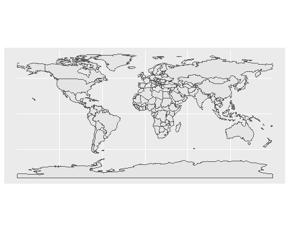<!-- -->

Aesthetics (*aes*) are the same as other ggplots. We can fill by a
variable if inside aes(), and values outside aes will apply to the
shape.

With the pop layer as the fill aesthetic, we see a dramatic bright blue
color in China and India. We can improve the scaling of this variable by
showing color as the log of population. This shows a dramatic pathwork
of population sizes across South America, Africa, and Asia as well.

``` r
ggplot(data=world,aes(fill=pop))+geom_sf() # alter shape fill by population
```

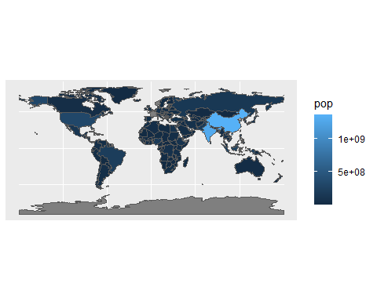<!-- -->

``` r
ggplot(data=world,aes(fill=log10(pop)))+ # alter shape fill by log10 of population
  geom_sf()+
  scale_fill_gradientn(
    colors=c("blue","red"), # two end members of color gradient
    limits=c(7,9.3), # max and min of scale
    breaks=7:9, # breaks values for the plot legend
    labels=10^c(7:9), # show labels as 10 to the power of 7 through 9
    na.value="blue" # color for values outside limits()
  )
```

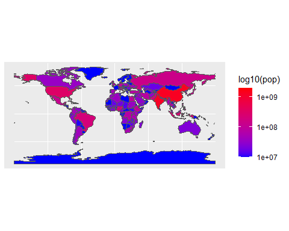<!-- -->

We can also fill the color with a categorical value like region.

``` r
ggplot(data=world,aes(fill=region_un))+geom_sf()
```

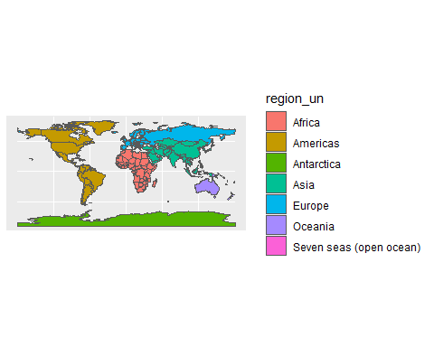<!-- -->

Earlier, we commented how this geospatial data object behaved a bit like
a dataframe. We can in fact operate on this object with many functions
we often use with dataframes!

For example, we can *subset* the world dataset to plot only the boundary
of Canada. Think earlier when we discussed geospatial operations. We can
create a new object called Canada. We’ve reduced the amount of
information and spatial extent relative to the world object: we no
longer have information about any countries besides Canada. But, we’ve
kept the information type the same: it’s still a polygon.

``` r
ggplot(data=subset(world,name_long=="Canada"))+geom_sf(color=2)
```

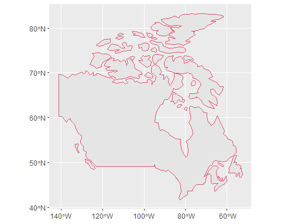<!-- -->

``` r
Canada = subset(world,name_long=="Canada")
head(Canada)
```

    ## Simple feature collection with 1 feature and 10 fields
    ## Geometry type: MULTIPOLYGON
    ## Dimension:     XY
    ## Bounding box:  xmin: -140.9978 ymin: 41.67511 xmax: -52.6481 ymax: 83.23324
    ## Geodetic CRS:  WGS 84
    ## # A tibble: 1 × 11
    ##   iso_a2 name_long contin…¹ regio…² subre…³ type  area_…⁴    pop lifeExp gdpPe…⁵
    ##   <chr>  <chr>     <chr>    <chr>   <chr>   <chr>   <dbl>  <dbl>   <dbl>   <dbl>
    ## 1 CA     Canada    North A… Americ… Northe… Sove…  1.00e7 3.55e7    82.0  43079.
    ## # … with 1 more variable: geom <MULTIPOLYGON [°]>, and abbreviated variable
    ## #   names ¹​continent, ²​region_un, ³​subregion, ⁴​area_km2, ⁵​gdpPercap

## Plotting World borders with tmap

tmap is an exciting package for geospatial data visualization. The
package is covered extensively in the book *Geocomputation with R* by
Robin Lovelace and others. Throughout this workshop, maybe try to apply
examples in the tmap format!

``` r
library(tmap)
tm_shape(world)+tm_borders()
```

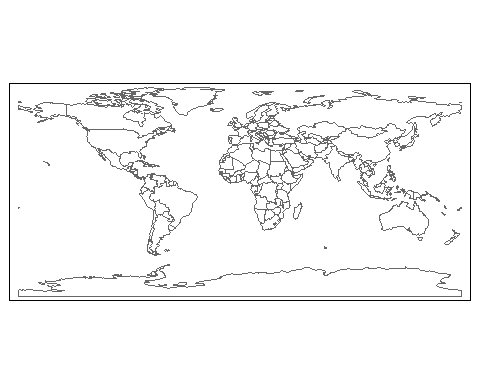<!-- -->

``` r
tm_shape(world)+tm_borders()+tm_fill(col="pop")
```

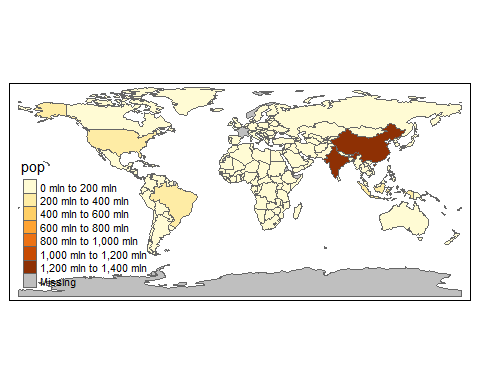<!-- -->

``` r
tm_shape(world)+tm_fill(col="region_un")
```

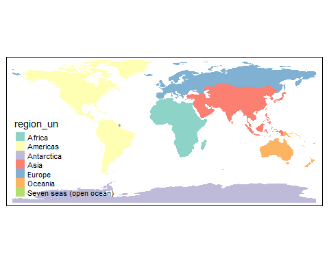<!-- -->

``` r
tm_shape(shp=subset(world,name_long=="Canada"))+tm_borders()
```

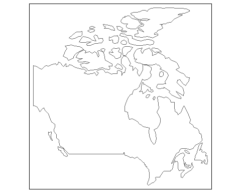<!-- -->

Challenge: create the following plots:

Did I subset by a particular region, or just a group of countries?

``` r
tm_shape(shp=subset(world,name_long%in%c("Canada","United States","Mexico")))+tm_borders()
```

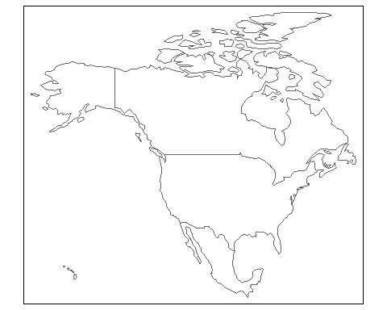<!-- -->

``` r
tm_shape(shp=subset(world,subregion=="Eastern Asia"))+tm_fill(col="gray")+tm_borders(lwd=2)
```

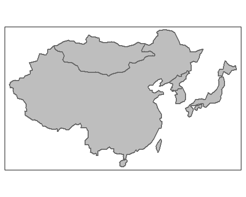<!-- -->

# Section 2: Reviewing Map and Shape Projections

Let’s explore what our data tells us about its projection type. *st_crs*
queries the coordinate reference information for the shapefile. We see
two data types: the EPSG code and the proj4string. EPSG stands for
European Petroleum Survey Group, and is an internationally recognized
numeric code defining the coordinate reference system or **CRS**. The
proj4string shares the same information, but in text format. From this
we can see that the data are projected according to the World Geodetic
System of 1984, in latitudinal and longitudinal coordinates.

``` r
st_crs(world)
```

    ## Coordinate Reference System:
    ##   User input: EPSG:4326 
    ##   wkt:
    ## GEOGCRS["WGS 84",
    ##     DATUM["World Geodetic System 1984",
    ##         ELLIPSOID["WGS 84",6378137,298.257223563,
    ##             LENGTHUNIT["metre",1]]],
    ##     PRIMEM["Greenwich",0,
    ##         ANGLEUNIT["degree",0.0174532925199433]],
    ##     CS[ellipsoidal,2],
    ##         AXIS["geodetic latitude (Lat)",north,
    ##             ORDER[1],
    ##             ANGLEUNIT["degree",0.0174532925199433]],
    ##         AXIS["geodetic longitude (Lon)",east,
    ##             ORDER[2],
    ##             ANGLEUNIT["degree",0.0174532925199433]],
    ##     USAGE[
    ##         SCOPE["Horizontal component of 3D system."],
    ##         AREA["World."],
    ##         BBOX[-90,-180,90,180]],
    ##     ID["EPSG",4326]]

``` r
st_crs(world)$proj4string
```

    ## [1] "+proj=longlat +datum=WGS84 +no_defs"

## Reprojecting Vector Data

So far we’ve been looking at the world through the Mercator Projection.
We’ll use the pipe to pass world to *st_transform* and specify several
different proj4 strings.

``` r
projMollweide="+proj=moll +lon_0=0 +x_0=0 +y_0=0 +ellps=WGS84 +units=m +no_defs"
projRobinson="+proj=robin +lon_0=0 +x_0=0 +y_0=0 +a=6371000 +b=6371000 +units=m +no_defs"
projGallPeters="+proj=cea +lon_0=0 +lat_ts=45 +x_0=0 +y_0=0 +ellps=WGS84 +units=m +no_defs"

lapply(1:3,function(X){ # sequence through 3 operations
  ggplot()+
    geom_sf(
      data=st_transform(world,
      list( # feed a list of length 3 to st_transform
      projMollweide, 
      projRobinson,
      projGallPeters
      )[[X]] # use X to sequence through the 3 projections
    ))+
    ggtitle(
      c("Mollweide",
        "Robinson Sphere",
        "Gall-Peters Orthographic")[X] 
      # use X to sequence through 3 titles
    )
})
```

    ## [[1]]

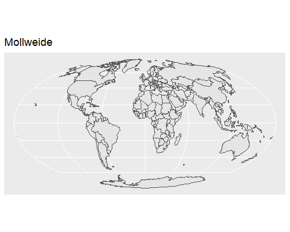<!-- -->

    ## 
    ## [[2]]

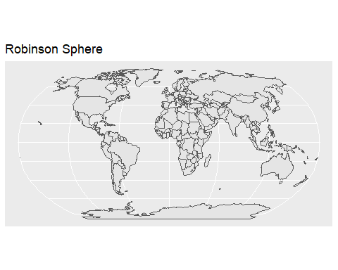<!-- -->

    ## 
    ## [[3]]

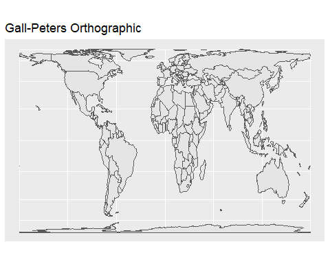<!-- -->

## Reproject Canada

We’ve analyzed the population data contained in the world shapefile. We
can also modify the shapefile itself. We will re-project the shapefile
from a the Ellipsoid WGS84 projection to the Canada Albers Equal Area
Conic Projection. I find this much more visually appealing for Canada.

``` r
Proj_AEA_Can=c("+proj=aea +lat_1=50 +lat_2=70 +lat_0=40 +lon_0=-96 +x_0=0 +y_0=0 ",
       "+ellps=GRS80 +datum=NAD83 +units=m +no_defs")%>%paste0(.,collapse = "")
# Canada Albers Equal Area Conic Projection
# visit http://spatialreference.org/ref/esri/canada-albers-equal-area-conic/proj4/
CanadaAEA=world%>%
  subset(.,name_long=="Canada")%>%
  st_transform(.,Proj_AEA_Can)
ggplot()+
  geom_sf(data=CanadaAEA)
```

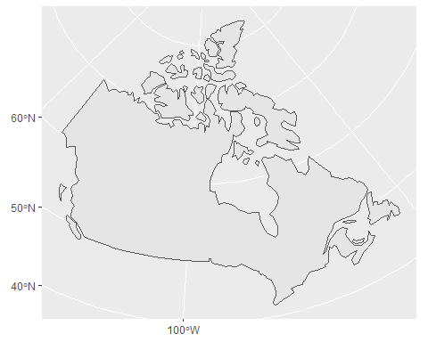<!-- -->

# Section 3: Map Aesthetics

Let’s add a few map elements inherited from the *ggsn* package. These
are completely compatible with ggplot. We’ll add a north arrow and scale
bar, and we can get rid of the grid lines with blank(). If you wanted
the axes and coordinates, you can adjust the parameters of theme().

``` r
map=ggplot()+
  geom_sf(data=CanadaAEA)+
  ggsn::north(CanadaAEA,symbol = 3,scale=0.2)+ # North arrow
  ggsn::scalebar(CanadaAEA, # Scale Bar
           dist = 1000, dist_unit = "km", # size of bar on map
           transform = FALSE,
           location = "bottomleft", # position
           st.size = 3 # text size
           )+
  ggtitle("Map of Canada")
map+ggsn::blank()  # white background
```

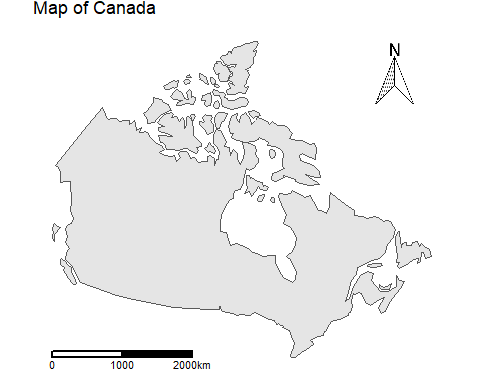<!-- -->

``` r
map+theme(panel.background=element_rect(fill=0,color=1), # fill=white, black outline
          axis.title=element_blank(), # no axis titles
          panel.grid=element_line(color="light gray")) # gray grid lines
```

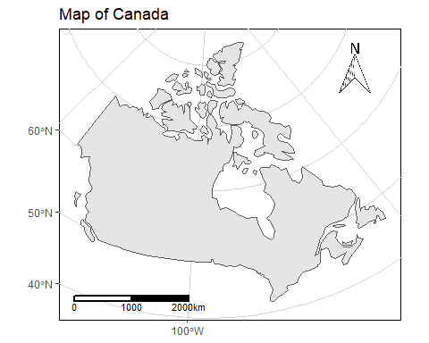<!-- -->

Let’s try this with *tmap* as well.

``` r
map=tm_shape(CanadaAEA)+tm_polygons()+
  tm_layout(title="Map of Canada")+
  tm_compass(type="arrow",position = c("right","top"))+
  tm_scale_bar(breaks=c(0,1000,2000),position = c("left","bottom"),text.size = 0.7)
map+tm_layout(frame = FALSE)
```

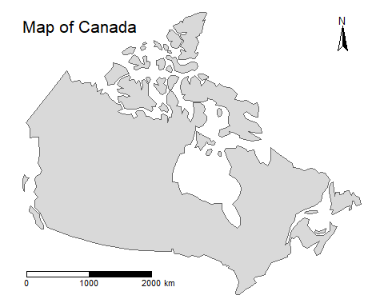<!-- -->

``` r
map+tm_layout(frame=TRUE)+tm_grid(projection = "+proj=longlat")
```

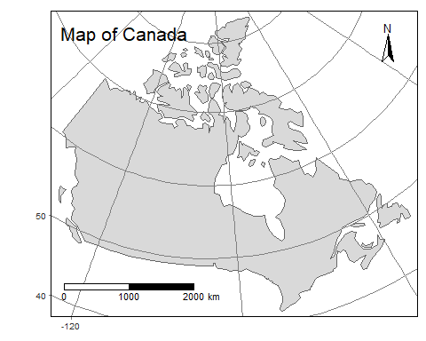<!-- -->

## Joining data

*spData* comes with data on where our coffee comes from! Use *left_join*
from *dplyr* to add this data to world. Use the Robinson Sphere to
accentuate the equatorial belt. We’ll use the *st_centroid* function
nested within *st_coordinates* and *cbind* to add X and Y coordinates to
draw labels. We may only want labels for the top coffee contributing
countries, so we can use subset.

``` r
head(coffee_data)
```

    ## # A tibble: 6 × 3
    ##   name_long                coffee_production_2016 coffee_production_2017
    ##   <chr>                                     <int>                  <int>
    ## 1 Angola                                       NA                     NA
    ## 2 Bolivia                                       3                      4
    ## 3 Brazil                                     3277                   2786
    ## 4 Burundi                                      37                     38
    ## 5 Cameroon                                      8                      6
    ## 6 Central African Republic                     NA                     NA

``` r
world_coffee=world%>% 
  subset(.,select=c(name_long)) %>% 
  # pass to left_join, join by "name_long"
  left_join(.,coffee_data,by="name_long")%>% 
  st_transform(.,
       "+proj=robin +lon_0=0 +x_0=0 +y_0=0 +a=6371000 +b=6371000 +units=m +no_defs"
               ) %>% 
  cbind(.,st_coordinates(st_centroid(.))) # add coordinates of centroids to data

  
ggplot()+
  geom_sf(data=world_coffee,aes(fill=coffee_production_2017*60/1000))+
  # spData tells us production is in units of thousands of 60 kg bags produced by country
  # multiple by 60kg/bag to get kg and divide by 10^3 to get metric tons
  geom_label_repel( # label the countries
    data=subset(world_coffee,coffee_production_2017>500), # take top coffee producers
    aes(x=X,y=Y,label=name_long), # label aesthetics
                   box.padding = 1, # distance between label and point
                   segment.size=1 # line width
                   )+
  scale_fill_gradientn(name=expression(paste(10^6,"kg coffee ",yr^-1)),
                       # complex text made with expression
    colors=c("lightgray","brown"),
    na.value="white" # value for countries with no data?
    )+
  theme(legend.position = "bottom", # where to place the legend
        panel.background = element_blank(), # remove panel background
        axis.title=element_blank() # remove all axis titles
        )+
  ggtitle("World Coffee Production") # add a title
```

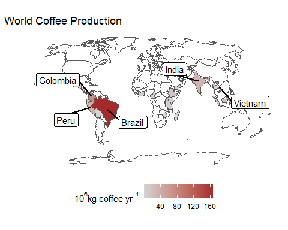<!-- -->

Think about what geospatial operation happened here. We took the world
data, and added information that wasn’t there before! So we increased
the amount of information, but kept data for all the countries, even
though only some can produce coffee. In many cases with *joins*, you
have one geospatial object being joined with new information in a
tabular format. There are cases where you will join information from two
or more sets of geospatial objects, but this can quickly become chaotic.

# Section 4. Working with Raster Data

## Raster Data Format

The eBird project has multiple data products that can be used for
academic research or hobby science. I have down-sized some data from the
Status and Trends dataset for two bird species: the Eastern Bluebird and
the Bobolink. Use the *raster* function to read in a raster. These data
are for occurrence frequency on an annual scale.

``` r
blue = raster("data/EBirdData/easblu_occur_year_Ontario.grd")
bobo = raster("data/EBirdData/boboli_occur_year_Ontario.grd")
```

There are many many different types of raster file formats. The raster
package is wonderful in that it can read in almost all of them. (Read
more information on raster
files)\[<https://pro.arcgis.com/en/pro-app/latest/help/data/imagery/supported-raster-dataset-file-formats.htm>\].

Like we did when we first started examining the world shape, let’s just
call our raster object to see its description:

``` r
blue
```

    ## class      : RasterLayer 
    ## dimensions : 761, 1010, 768610  (nrow, ncol, ncell)
    ## resolution : 3780, 2320  (x, y)
    ## extent     : -1099399, 2718401, 263770.6, 2029291  (xmin, xmax, ymin, ymax)
    ## crs        : +proj=aea +lat_0=40 +lon_0=-96 +lat_1=50 +lat_2=70 +x_0=0 +y_0=0 +datum=NAD83 +units=m +no_defs 
    ## source     : easblu_occur_year_Ontario.grd 
    ## names      : full_year 
    ## values     : 0, 0.6049805  (min, max)

There’s useful information here: we see that there are 770 thousand data
points in this raster. The crs of the data is pre-defined, and we can
see it is the Canada Albers Equal Area Conic Projection, with units of
metres.

## Plotting Raster Data

We can use the basic plot function to try to examine the data. With
basic plot, we can add the Ontario border.

``` r
Ontario = st_read("data/CanadaCensusShapes/Canada_provinces_Ontario.shp")
```

    ## Reading layer `Canada_provinces_Ontario' from data source 
    ##   `C:\Users\tyler\OneDrive\Software\R_Projects\workshops\2022_Rgis_worskhop\R-GIS-Workshop\data\CanadaCensusShapes\Canada_provinces_Ontario.shp' 
    ##   using driver `ESRI Shapefile'
    ## Simple feature collection with 1 feature and 2 fields
    ## Geometry type: MULTIPOLYGON
    ## Dimension:     XY
    ## Bounding box:  xmin: 56717.38 ymin: 297225.5 xmax: 1693748 ymax: 1887182
    ## Projected CRS: Canada_Albers_Equal_Area_Conic

``` r
plot(blue,xlim=c(800000,1800000),ylim=c(260000,900000))
plot(Ontario$geometry,add=TRUE,main="Eastern Bluebird\nAnnual Frequency")
```

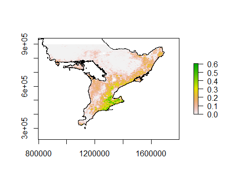<!-- -->

### Plot Aesthetics, Multiple Objects with tmap

As we saw earlier, options to plot geospatial data include base plot,
ggplot, and tmap. For plotting both raster and vector data, tmap has
made this much easier than ggplot.

A note about zooming plots: \* Base plot uses xlim and ylim as arguments
in plot \* ggplot uses +coord_sf(xlim=…,ylim=…) to set coordinates for
maps \* tmap uses a more confusing format, where you must create a
bounding box (bbox) object, to be fed to the tm_shape() function.

A note about layering objects with tmap: \* In ggplot, to layer objects
like we did with the coffee plot above, you simply add (+) them on top
of each other. In the coffee plot, we had +geom_sf() and some aesthetics
to plot our countries, color coded by coffee production, and we added
the +geom_label_repel() function to add a second feature, which were
labels attached to the centroid points of a subset of countries. \* In
tmap, each object addition needs two sequential lines: first, a call of
tm_shape() listing the object, and then a mapping function
(e.g. tm_raster, tm_borders, tm_polygons) that corresponds with the
object type.

``` r
sOntbbox = tmaptools::bb(matrix(c(
  800000, #xmin
  260000, #ymin
  1800000,#xmax
  900000  #ymax
  ),2,2))
# st_as_sf(st_as_sfc(sOntbbox))

tm_shape(blue,bbox=sOntbbox)+
  tm_raster(palette = "Spectral",title = "Annual Frequency")+
  tm_shape(Ontario)+
  tm_borders()+
  tm_layout(legend.position = c("right","center"),
            main.title = "Eastern Bluebird")
```

<!-- -->

``` r
bobo_freq <- rasterToContour(bobo,maxpixels = 10000,nlevels=4)
class(bobo_freq)
```

    ## [1] "SpatialLinesDataFrame"
    ## attr(,"package")
    ## [1] "sp"

``` r
tm_shape(bobo,bbox=sOntbbox)+
  tm_raster(palette = "Spectral",title = "Annual Frequency")+
  tm_shape(bobo_freq)+
  #tm_lines()+
  tm_iso()+
  tm_shape(Ontario)+
  tm_borders()+
  tm_layout(legend.position = c("right","center"),
            main.title = "Bobolink")
```

<!-- -->
\## Multiband Raster Data

Here’s a fun excercise: map the Flag of Canada in the shape of the
country. Earlier we discussed raster formats. If you think about it,
common file types you interact with every day (e.g. png, jpeg) are
actually rasters!

``` r
CAFlag1 = raster("data/Flag of Canada.png")
CAFlag1
```

    ## class      : RasterLayer 
    ## band       : 1  (of  4  bands)
    ## dimensions : 600, 1200, 720000  (nrow, ncol, ncell)
    ## resolution : 1, 1  (x, y)
    ## extent     : 0, 1200, 0, 600  (xmin, xmax, ymin, ymax)
    ## crs        : NA 
    ## source     : Flag of Canada.png 
    ## names      : Flag_of_Canada 
    ## values     : 0, 255  (min, max)

``` r
plot(CAFlag1)
```

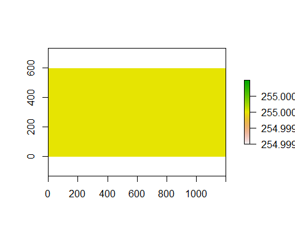<!-- --> Ok, so
we didn’t get anything inteligible from our plot. But the description of
this raster object CAFlag1 gives us some clues: there is a range of
values from 0 to 255, which is the maximum intensity of a pixel in a png
file. The description also tells us there are multiple bands in this png
file. If you know how computer images and screens work, you might guess
that the different bands map onto the Red Green Blue (RGB) colors in the
file.

Since there are multiple bands, we can instead use raster::stack to read
in the data.

``` r
CAFlag=raster::stack("data/Flag of Canada.png")
names(CAFlag)
```

    ## [1] "Flag_of_Canada.1" "Flag_of_Canada.2" "Flag_of_Canada.3" "Flag_of_Canada.4"

``` r
# A portable network graphic (PNG) file stores image color in four bands, and we see 
#    that each band has 600 by 1200 cells
plot(CAFlag)
```

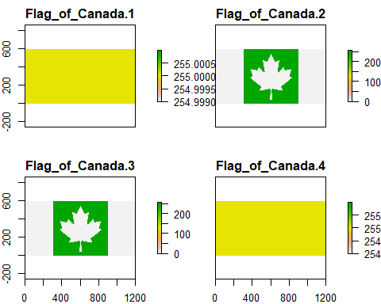<!-- -->

So now to test your knowledge of color theory, which of the bands map to
red, green, and blue?

The bands are actually in order! From red (1), green (2), to blue (3).
In the maple leaf shape, only red is at maximum intensity, so it will be
red. In the band around the leaf, all three colors are at maximum
intensity, so the resulting mixture will create white.

Let’s combine these bands as intended to be seen on a computer: with an
RGB plotting function.

``` r
raster::plotRGB(CAFlag,r=1,g=2,b=3)
```

<!-- -->

``` r
# we see that the first band stores the red data, green in the 2nd, and blue in the 3rd.
```

We’ve spent time on color theory, but let’s come back to GIS. This
excercise serves to show you how to map non-geospatial data. Here, we’ll
re-map the flag’s coordinates to latitude and longitude instead of its
pixel dimensions.

``` r
Canada=subset(world,name_long=="Canada")

extent(CAFlag)<-extent(Canada)
crs(CAFlag)<-st_crs(Canada)$proj4string
# set coordinates for our CAFlag image the same as our geospatial data

tm_shape(CAFlag$Flag_of_Canada.2)+
  tm_raster(col="Flag_of_Canada.2",palette=c("red","white"))+
  #     fill the raster by the value of the green band, 
  #     but specify the end color values of red and white
  tm_layout(bg.color = "gray",legend.show = F)+
  tm_shape(Canada)+
  tm_borders(col=1)
```

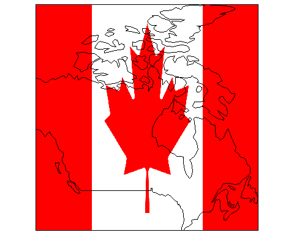<!-- -->

## Modifying Raster Data: Mask

Maybe we have a dataset at a larger scale than our area of interest. Or
maybe we just want an aesthetically pleasing map with data contained to
an area of interest (as a vector polygon). So far in this workshop, we
haven’t performed any subtractive geospatial operations on vector data.
Here, we’ll use the “mask” function to remove the flag information from
outside of Canada’s land border.

``` r
CAFlagM=raster::mask(CAFlag,Canada) # we will mask out the parts of our image outside Canada

tm_shape(CAFlagM$Flag_of_Canada.2)+
  tm_raster(col="Flag_of_Canada.2",palette=c("red","white"))+
  #     fill the raster by the value of the green band, 
  #     but specify the end color values of red and white
  tm_layout(bg.color = "gray",legend.show = F)+
  tm_shape(Canada)+
  tm_borders(col=1)
```

<!-- -->

These last graphs might have you thinking in the back of your head that
this isn’t the shape you’re used to seeing for Canada. This is the
effect of map projection. The last plot is shown using the Mercator
projection, using longitude and latitude as coordinates.

## Projections and Raster Data

Let’s revisit our flag, and see how changing the projection of our
shapefile has changed several previously linear features. We’ll use
*projectRaster* to use our original raster and *transform* or *project*
the data to a new CRS. Remember, an important principal of working with
GIS data is that all data you’re working with are in the same CRS when
analyzing and plotting.

``` r
CAFlagM2=CAFlagM %>% projectRaster(crs=st_crs(CanadaAEA)$proj4string)
tm_shape(CAFlagM2$Flag_of_Canada.2)+
  tm_raster(col="Flag_of_Canada.2",palette=c("red","white"))+
  tm_layout(bg.color = "gray",legend.show = F)+
  tm_shape(CanadaAEA)+tm_borders(col=1)
```

    ## stars object downsampled to 1746 by 572 cells. See tm_shape manual (argument raster.downsample)

<!-- -->

## More Raster Practice: Multiband Imagery

Let’s explore some data built into *spDataLarge*. We have access to a
Digital Elevation Model from Zion National Park in Utah, USA.

``` r
zion_dem=system.file("raster/srtm.tif", package = "spDataLarge")%>%raster()
zion_shp=system.file("vector/zion.gpkg", package = "spDataLarge")%>%st_read()%>%st_transform(.,proj4string(zion_dem))
```

    ## Reading layer `zion' from data source 
    ##   `C:\Users\tyler\AppData\Local\R\win-library\4.2\spDataLarge\vector\zion.gpkg' 
    ##   using driver `GPKG'
    ## Simple feature collection with 1 feature and 11 fields
    ## Geometry type: POLYGON
    ## Dimension:     XY
    ## Bounding box:  xmin: 302903.1 ymin: 4112244 xmax: 334735.5 ymax: 4153087
    ## Projected CRS: UTM Zone 12, Northern Hemisphere

``` r
plot(zion_dem,main="Zion NP Elevation")
```

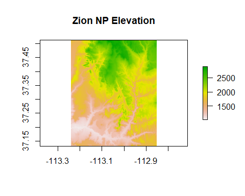<!-- -->

We see the map coordinates in latitude and longitude, and elevation by
color. We just used base plot to show this raster. Use tmap to plot the
dem with the Zional National Park boundary. *terrain.colors* provides a
nice color pallete for elevation maps, with white highest and green
lowest.

``` r
zion_dem_mask=zion_dem%>%
  raster::crop(.,extent(zion_shp))%>%
  raster::mask(.,zion_shp)

tm_shape(zion_dem_mask)+
  tm_raster(style="cont",palette = terrain.colors(5),title="Elev (m)")+
  tm_shape(zion_shp)+tm_borders()+
  tm_layout(main.title="Zion NP Elevation",
            legend.position = c("right","top"))+
  tm_scale_bar(position = c("left","bottom"))
```

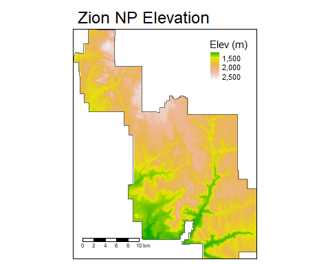<!-- -->

We also have satellite imagery taken over this area! The data we have
from the Landsat satellites has optical data in 4 color bands:

-   Blue 0.452 - 0.512 nm
-   Green 0.533 - 0.590 nm
-   Red 0.636 - 0.673 nm
-   Near Infrared (NIR) 0.851 - 0.879 nm

We can visualize all four bands:

``` r
landsat = system.file("raster/landsat.tif", package = "spDataLarge") %>%
  brick()

zion_shp=st_transform(zion_shp,crs(landsat))

plot(landsat)
```

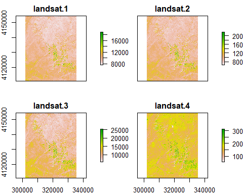<!-- -->

To put them together, we will use the *tm_rgb* function from *tmap* to
creata a True Color image from the three color bands.

``` r
tm_shape(landsat)+
  tm_rgb(r=3, # red band
         g=2, # green band
         b=1, # blue band
         max.value = 26000)+
  tm_shape(zion_shp)+
  tm_borders(col="white")+
  tm_scale_bar(position = c("left","bottom"),text.color = "white")+
  tm_layout(main.title= "Zion National Park",
            title="True Color Image",
            title.position = c("right","top"),
            title.color = "white"
            )
```

    ## stars object downsampled to 888 by 1125 cells. See tm_shape manual (argument raster.downsample)

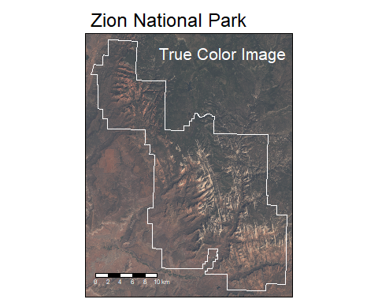<!-- -->

Often, researchers use the color bands from Landsat to derive various
data not visible to the naked eye. For instance, in the infrared, water
is highly absorbing, and trees generally emit in the IR. We can create a
false color image by swapping out IR for red.

``` r
tm_shape(landsat)+
  tm_rgb(r=4, # nearIR band
         g=2, # green band
         b=1, # blue band
         max.value = 32000)+
  tm_shape(zion_shp)+
  tm_borders(col="white")+
  tm_scale_bar(position = c("left","bottom"),text.color = "white")+
  tm_layout(main.title= "Zion National Park",
            title="False Color Image",
            title.position = c("right","top"),
            title.color = "white"
            )
```

    ## stars object downsampled to 888 by 1125 cells. See tm_shape manual (argument raster.downsample)

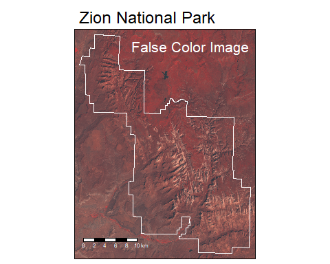<!-- -->

Notice how the lake in the upper middle remains dark, while the forest
in the upper portion shows up as very red. You can see the vegetation
along the stream channel in the lower part of the image as well.

## Extracting Data from Rasters

Raster data for Canadian biomass

<http://ftp.maps.canada.ca/pub/nrcan_rncan/Forests_Foret/canada-forests-attributes_attributs-forests-canada/2011-attributes_attributs-2011/>

``` r
Provinces = st_read("data/CanadaCensusShapes/Canada_provinces.shp")
```

    ## Reading layer `Canada_provinces' from data source 
    ##   `C:\Users\tyler\OneDrive\Software\R_Projects\workshops\2022_Rgis_worskhop\R-GIS-Workshop\data\CanadaCensusShapes\Canada_provinces.shp' 
    ##   using driver `ESRI Shapefile'
    ## Simple feature collection with 13 features and 2 fields
    ## Geometry type: MULTIPOLYGON
    ## Dimension:     XY
    ## Bounding box:  xmin: -2316316 ymin: 297225.5 xmax: 3093177 ymax: 4811816
    ## Projected CRS: Canada_Albers_Equal_Area_Conic

``` r
forest=raster("data/BiomassAG2.tif") %>% 
  raster::projectRaster(.,crs = st_crs(Provinces)$proj4string)

plot(forest,main="Aboveground Biomass")
```

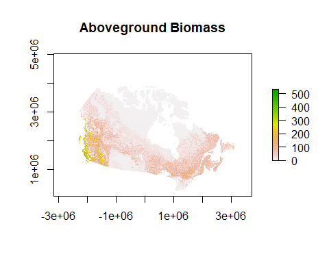<!-- -->

``` r
tm_shape(forest)+
  tm_raster(palette=c("beige","darkgreen"),title=expression("(Mg C "*ha^-1*")"))+
  tm_layout(main.title = "Aboveground Biomass",legend.position = c("right","top"))+
  tm_shape(shp = Provinces)+
  tm_borders(col=1)
```

    ## stars object downsampled to 1121 by 893 cells. See tm_shape manual (argument raster.downsample)

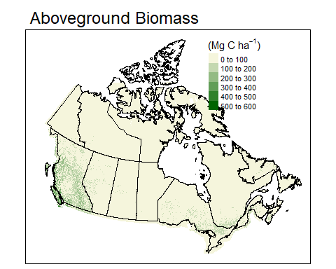<!-- -->

``` r
provBC=Provinces%>%
  subset(.,Pr_____=="British Columbia")%>%
  st_transform(.,proj4string(forest))
forestBC=forest%>%
  raster::sampleRegular(.,500000,asRaster=TRUE)%>%
  raster::crop(.,extent(provBC))%>%
  raster::mask(.,provBC)
cellsize=res(forestBC)

tm_shape(forestBC)+
  tm_raster(palette=c("beige","darkgreen"),title=expression("(Mg C "*ha^-1*")"))+
  tm_layout(main.title = "British Columbia",
            title = "Aboveground Biomass",
            legend.outside = TRUE,
            legend.outside.position = "right"
            )+
  tm_shape(shp = provBC)+
  tm_borders(col=1)
```

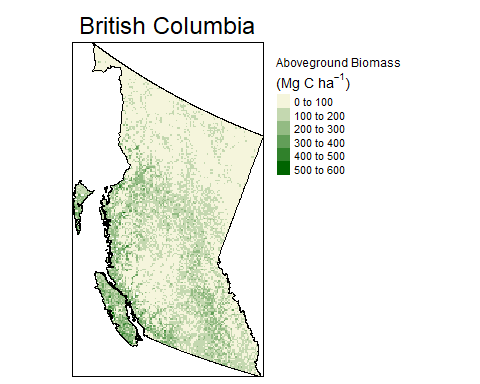<!-- -->

``` r
(sum(getValues(forestBC$BiomassAG2),na.rm=T)*
    cellsize[1]*cellsize[2]* # cell dimentions in m
    (100^-2)* # m2 to ha
    10^6* # Mg to g
    10^-15 # g to Pg
  )%>%round(.,2)%>%
  paste0(.," petagrams (billion tons) of carbon in BC forests")
```

    ## [1] "9.71 petagrams (billion tons) of carbon in BC forests"

## Working with Multiple Rasters

``` r
cover = raster("data/canada_2015_land_cover/CAN_NALCMS_2015_v2_land_cover_100m/landcover_SouthernOntario.tif")
coverkey = read.csv("data/canada_2015_land_cover/land_cover_key.csv")

rgb2hex <- function(r,g,b) rgb(r, g, b, maxColorValue = 255)
coverkey$HEX = sapply(1:nrow(coverkey),function(i){
  rgb2hex(coverkey$Red[i],coverkey$Green[i],coverkey$Blue[i])})
cover
```

    ## class      : RasterLayer 
    ## dimensions : 7005, 6995, 48999975  (nrow, ncol, ncell)
    ## resolution : 100, 100  (x, y)
    ## extent     : 1276920, 1976420, -239920, 460580  (xmin, xmax, ymin, ymax)
    ## crs        : +proj=laea +lat_0=45 +lon_0=-100 +x_0=0 +y_0=0 +datum=WGS84 +units=m +no_defs 
    ## source     : landcover_SouthernOntario.tif 
    ## names      : landcover_SouthernOntario 
    ## values     : 0, 18  (min, max)

``` r
lon=seq(-81.6,-79.8,0.1)
box=data.frame(
  lon=c(lon,rev(lon)),
  lat=c(rep(c(44.4,42.8),each=length(lon)))) %>%
  rbind(., .[1,]) %>%
  as.matrix()%>%
  list()%>%
  st_polygon()%>%
  st_sfc()%>%
  st_sf(., crs = 4326)%>%
  st_transform(.,Proj_AEA_Can)

boxi = box %>% st_transform(st_crs(cover)$proj4string)
coveri = cover %>%
  raster::crop(.,extent(boxi)) %>%
  raster::mask(.,boxi) %>%
  raster::projectRaster(.,crs = st_crs(bobo)$proj4string,method="ngb")
boxi = box %>% st_transform(st_crs(bobo)$proj4string)

raster::is.factor(coveri)
```

    ## [1] FALSE

``` r
coveri = raster::as.factor(coveri)
key = levels(coveri)[[1]]

key = left_join(key,coverkey[,c("ID","code","HEX")],by="ID")
levels(coveri) <- key
coveri
```

    ## class      : RasterLayer 
    ## dimensions : 2095, 1866, 3909270  (nrow, ncol, ncell)
    ## resolution : 102, 97.7  (x, y)
    ## extent     : 1152221, 1342553, 431126.1, 635807.6  (xmin, xmax, ymin, ymax)
    ## crs        : +proj=aea +lat_0=40 +lon_0=-96 +lat_1=50 +lat_2=70 +x_0=0 +y_0=0 +datum=NAD83 +units=m +no_defs 
    ## source     : memory
    ## names      : landcover_SouthernOntario 
    ## values     : 1, 18  (min, max)
    ## attributes :
    ##        ID        code     HEX
    ##  from:  1 Forest temp #003D00
    ##   to : 18       Water #4C70A3

``` r
tm_shape(coveri)+
  tm_raster(title = "Land Cover",
    palette = levels(coveri)[[1]]$HEX,style ="cat",
    showNA=FALSE)+
  tm_layout(main.title = "S Ontario Land Cover",
            legend.outside = TRUE,
            legend.outside.position = "right")
```

    ## stars object downsampled to 944 by 1060 cells. See tm_shape manual (argument raster.downsample)

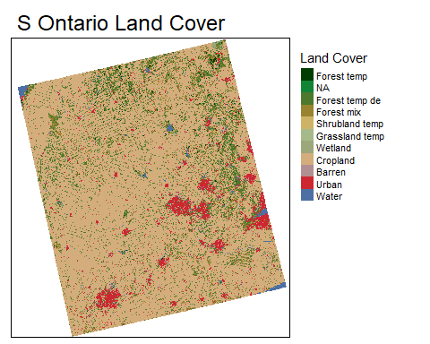<!-- -->

``` r
bobo_new = raster::resample(bobo,coveri) %>%
  raster::crop(.,extent(boxi)) %>%
  raster::mask(.,boxi)

tm_shape(bobo_new)+
  tm_raster(palette = "Spectral",title = "Annual Frequency")+
  tm_shape(boxi)+
  tm_borders()+
  tm_layout(main.title = "Bobolink in S Ontario",
            legend.outside = TRUE,
            legend.outside.position = "right")
```

    ## stars object downsampled to 930 by 1076 cells. See tm_shape manual (argument raster.downsample)

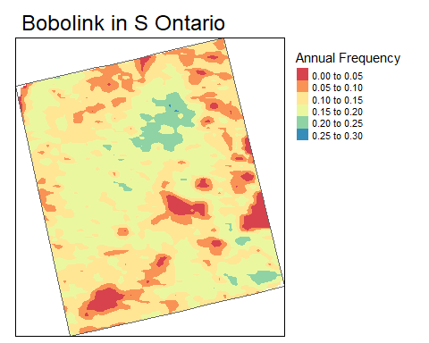<!-- -->

``` r
coveri = raster::crop(coveri,bobo_new)

bobo_data = data.frame(
  bobo_freq = values(bobo_new),
  landcover = values(coveri)
)
bobo_data$landcover = round(bobo_data$landcover)
bobo_data$landcat = factor(bobo_data$landcover,
                           levels=1:19,
                           labels=coverkey$code
                           )
bobo_data = subset(bobo_data,!is.na(landcover))
landcoverpct = plyr::count(bobo_data$landcover)
landcoverpct$pct = landcoverpct$freq/sum(landcoverpct$freq)
landcoverpct$code = factor(landcoverpct$x,
                           levels=1:19,
                           labels=coverkey$Description
                           )
```

``` r
ggplot(data=subset(bobo_data,landcover%in%c(5:6,14:17)))+
  geom_boxplot(aes(x=landcat,y=bobo_freq))+
  theme(axis.text.x = element_text(angle=90))+
  ggtitle("Bobolink in S Ontario")+
  ylab("Annual frequency")+
  xlab("Landcover")
```

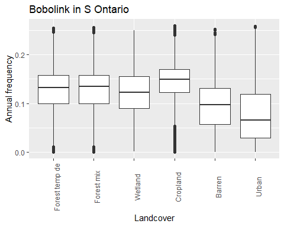<!-- -->
