Advanced Vector Excercise: Canadian Population
================
Tyler Hampton

- [Advanced Vector Excercise: Canadian
  Population](#advanced-vector-excercise-canadian-population)
  - [Read Canada Census Data](#read-canada-census-data)
  - [Inspect the Canadian Census data from
    2016.](#inspect-the-canadian-census-data-from-2016)
  - [Join Data to Census Shapefiles](#join-data-to-census-shapefiles)
  - [Practice Map Making](#practice-map-making)
  - [Aggregating Shapefiles](#aggregating-shapefiles)
    - [More Practice Mapmaking](#more-practice-mapmaking)
  - [Answer a popular question: What percent of Canadians live within
    100 miles of the US
    border?](#answer-a-popular-question-what-percent-of-canadians-live-within-100-miles-of-the-us-border)
    - [Create a buffer](#create-a-buffer)
    - [Use st_intersection to extract census
      tracts](#use-st_intersection-to-extract-census-tracts)
  - [What about Canada’s population in relation to some US city?
    Seattle?](#what-about-canadas-population-in-relation-to-some-us-city-seattle)
    - [Create a new shapefile](#create-a-new-shapefile)
    - [Calculate](#calculate)

``` r
#this is a custom function that that can load multiple packages at once
loadpackages=function(packages){  for(p in packages){
  if(!require(p,character.only=T)){install.packages(p)}
  # IF require returns FALSE, the package is missing and will be installed
  library(p,character.only=T,quietly=T,verbose=F)
  # next, it calls the package with library
  }} 


loadpackages(c(
           "tmap", # Thematic Map Visualization, makes maps!
           "ggplot2", # Makes ggplots! Can also make maps
           "sf",   # "Simple Features", handles vector data
           "raster", # For working with Raster Data
           "terra", # A newer package for working with Raster data
           "ggrepel", # Labels on ggplots
           "plyr", # The split-apply-combine paradigm
           "data.table", # Works with data.frames
           "dplyr", # Data manipulation
           "purrr", # Functional Programming Tools
           "devtools", # Download custom R packages
           "spData" # Spatial Datasets
           ))

if(!require("dfsspatdat",character.only=T)){
  options(timeout = 400) # Download time may approach 400 seconds
  devtools::install_github("data-for-science/dfs_spatdat")
}
# devtools::install_github installs a package from its github directory
library(dfsspatdat)

if(!require("spDataLarge",character.only=T)){
  devtools::install_github("Nowosad/spDataLarge")
}
library(spDataLarge)
```

# Advanced Vector Excercise: Canadian Population

In the main workshop, we used tools like dim and head to examine how R
reads in and interprets geospatial data. Much like we operate on regular
dataframes, we used tools like subset, aggregate, left_join, and
setorder to manipulate shapefiles. Most importantly, we saw how
shapefiles are different than dataframes in that they contain coordinate
data that is in some coordinate system. In order to make a map, we need
to ensure that all our data are in the same coordinate reference system
(CRS). We used st_crs to confirm this, and st_transform to re-project
data into difference CRSs.

In this next section, we will practice many of the same skills, but with
new kinds of data (points). As well, we will practice geospatial unions,
intersections, and clippings. We’ll also learn how to create our own
shapefiles from raw data.

## Read Canada Census Data

``` r
data("can_cendat")
names(can_cendat)[names(can_cendat)=="PRNAME"] = "PRENAME"

Proj_AEA_Can = sf::st_crs("+proj=aea +lat_1=50 +lat_2=70 +lat_0=40 +lon_0=-96 +x_0=0 +y_0=0
                 +ellps=GRS80 +datum=NAD83 +units=m +no_defs")
# Canada Albers Equal Area Conic Projection
# visit http://spatialreference.org/ref/esri/canada-albers-equal-area-conic/proj4/

data("world")
CanadaAEA = world%>%
  subset(.,name_long=="Canada")%>%
  st_transform(.,Proj_AEA_Can)


# Canada Census Tract Shapefile
data("can_cdiv")
can_cdiv = can_cdiv %>%
  st_transform(.,Proj_AEA_Can)

# Canadian Cities
data("worldcities")
CAcities = worldcities %>%
  st_transform(.,Proj_AEA_Can) %>% 
  subset(.,sov0name=="Canada" & pop_max>200000) %>%
  cbind(.,st_coordinates(st_centroid(.)))
```

## Inspect the Canadian Census data from 2016.

We see that population within census divisions is log-normally
distributed. We can also confirm that the population density
calculations within each census division match the population and area
values. The population of Canada in 2016 was 35.2 million people.

``` r
ggplot(data=can_cendat)+
  geom_histogram(aes(x=pop.16))+
  scale_x_log10()
```

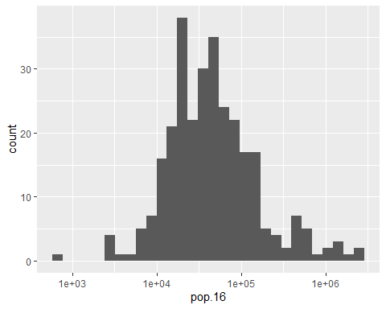<!-- -->

``` r
# Confirm that Population Density calculations match areas
ggplot(data=can_cendat)+
  geom_point(aes(y=pop.16,
                 x=landarea.sqkm*
                   popdens.sqkm))+
  geom_abline(intercept=0,slope=1)
```

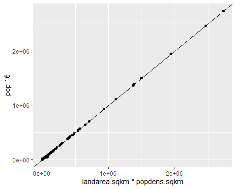<!-- -->

``` r
print(paste(round(sum(can_cendat$pop.16,na.rm=TRUE)*10^-6,1),"million people"))
```

    ## [1] "35.2 million people"

## Join Data to Census Shapefiles

``` r
can_cdiv = can_cdiv %>%
  dplyr::left_join(.,can_cendat,by=c("CDUID"))
```

## Practice Map Making

The census shapefiles do not come loaded with data, but we can use
*left_join* from dplyr to join the data into the new shapefile. We’ll do
this join inside a pipe, after reading in the data and transforming it.
One more layer to add: some major Canadian cities. The cities dataset
conviniently comes with latitude and longitude, but we need to project
these data separate from the feature geometries with *st_transform*.
Similar to how we got points to label coffee-producing countries with we
will “bind” point coordinates to the original layer.

When we go to construct a map, we can “layer” our shapefiles from bottom
(first) to top (last) in ggplot. *geom_label_repel* is a great function
for making sure our city labels don’t overlap. Finally, add a map title,
north arrow, and scale bar.

``` r
basemap=ggplot()+
  geom_sf(data=world %>%subset(.,subregion=="Northern America")%>%st_transform(.,Proj_AEA_Can),fill="white")+
  ggtitle("Canada Census Divisions")+
  theme_void()

basemap+
  geom_sf(data=can_cdiv)+
  geom_sf(data=CAcities,size=2)+
  geom_label_repel(data=CAcities,
                   aes(X,Y,label=nameascii),
                   segment.size = 1,
                   nudge_y = 10,
                   box.padding = 0.5
                   )+
  coord_sf(xlim = extent(can_cdiv)[1:2],ylim = extent(can_cdiv)[3:4])
```

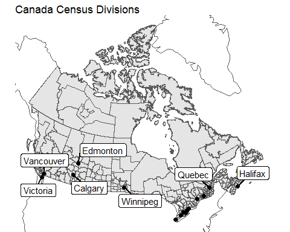<!-- -->

Next, we’ll practice visualizing the data within the census data.

``` r
basemap+
  geom_sf(data=can_cdiv,aes(fill=log10(popdens.sqkm)),
          col="transparent")+
  scale_fill_gradient(name=expression(paste("Population ",km^-2)),
                      low="darkblue",high="red",na.value="darkblue",
                      limits=c(-1.2,3.5),breaks=c(-1:3),labels=(10^c(-1:3)))+
  geom_point(data=CAcities,aes(x=X,y=Y,size=pop_max))+
  coord_sf(xlim = extent(can_cdiv)[1:2],ylim = extent(can_cdiv)[3:4])
```

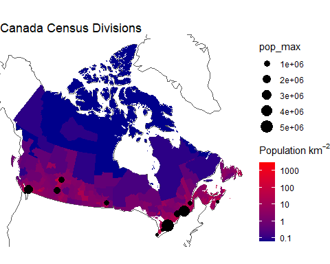<!-- -->

## Aggregating Shapefiles

``` r
data("can_prov")
ggplot()+geom_sf(data=can_prov,col=1,fill="white")
```

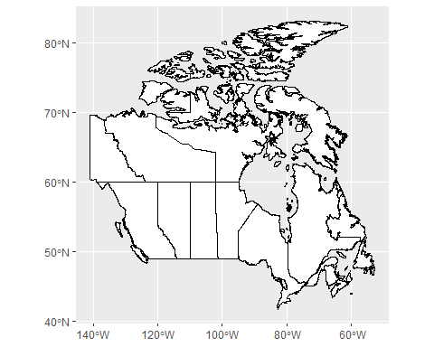<!-- -->

If you inspect the provinces data, we’ve lost all the census data and
are left with only the geometry. If we want to reattach some data from
the census, we can use *aggregate* and *left_join*.

``` r
head(can_prov)
```

    ## Simple feature collection with 6 features and 6 fields
    ## Geometry type: MULTIPOLYGON
    ## Dimension:     XY
    ## Bounding box:  xmin: -141.0181 ymin: 43.39211 xmax: -59.67046 ymax: 69.64746
    ## Geodetic CRS:  NAD83
    ##   PRUID                                  PRNAME          PRENAME
    ## 1    60                                   Yukon            Yukon
    ## 2    47                            Saskatchewan     Saskatchewan
    ## 3    46                                Manitoba         Manitoba
    ## 4    12        Nova Scotia / Nouvelle-\xc9cosse      Nova Scotia
    ## 5    48                                 Alberta          Alberta
    ## 6    59 British Columbia / Colombie-Britannique British Columbia
    ##                PRFNAME PREABBR  PRFABBR                       geometry
    ## 1                Yukon    Y.T.       Yn MULTIPOLYGON (((-136.4776 6...
    ## 2         Saskatchewan   Sask.    Sask. MULTIPOLYGON (((-102.0125 6...
    ## 3             Manitoba    Man.     Man. MULTIPOLYGON (((-94.825 60,...
    ## 4   Nouvelle-\xc9cosse    N.S. N.-\xc9. MULTIPOLYGON (((-66.01903 4...
    ## 5              Alberta   Alta.     Alb. MULTIPOLYGON (((-110.0125 6...
    ## 6 Colombie-Britannique    B.C.    C.-B. MULTIPOLYGON (((-123.3228 4...

``` r
can_prov=can_prov%>%left_join(.,
            can_cendat[,"pop.16"]%>%
              aggregate(by=list(can_cendat$PRENAME),FUN="sum")%>%
              setNames(.,c("PRENAME","Pop16")),
            by=c("PRENAME")
          )
```

``` r
ggplot()+
  geom_sf(data=world%>%
            subset(subregion=="Northern America")%>%
            st_transform(.,Proj_AEA_Can),
          alpha=0.5)+
  geom_sf(data=can_prov,aes(fill=log10(Pop16)))+
  scale_fill_gradient(name="Population ",low="darkblue",high="red",na.value="darkblue",
                      limits=c(4.5,7.5),breaks=c(5:7),labels=(10^c(5:7)))+
  coord_sf(xlim = extent(can_cdiv)[1:2],ylim = extent(can_cdiv)[3:4])+
  ggtitle("Canada Census Divisions")+
  theme_void()
```

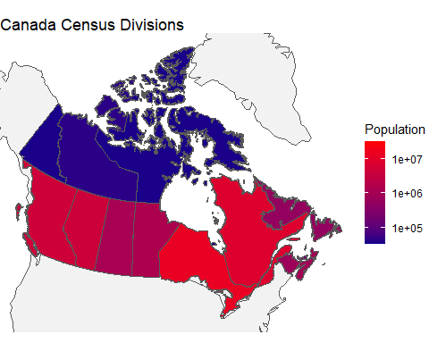<!-- -->

### More Practice Mapmaking

Replicate the following map.

``` r
Ontario=subset(can_prov,PRENAME=="Ontario")
ggplot()+
  geom_sf(data=Ontario,lwd=3,fill="transparent")+
  geom_sf(data=subset(can_cdiv,PRNAME=="Ontario"),
          aes(fill=log10(popdens.sqkm)),
          col="transparent")+
  scale_fill_gradient(name=expression(paste("Population ",km^-2)),
                      low="darkblue",high="red",na.value="darkblue",
                      limits=c(0.5,3.5),breaks=c(1:3),labels=(10^c(1:3)))+
  coord_sf(xlim = extent(Ontario)[1:2],ylim = extent(Ontario)[3:4])+
  ggtitle("Canada Census Divisions")+
  theme_void()
```

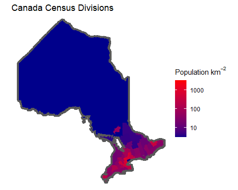<!-- -->

## Answer a popular question: What percent of Canadians live within 100 miles of the US border?

### Create a buffer

*st_crs* tells us that the units of our map is in meters, so we need to
convert from miles. We will transform a USA shapefile to the appropriate
projection, then use st_buffer to create the buffered shape.

``` r
USA=world%>%
  subset(.,name_long=="United States")%>%
  st_transform(.,Proj_AEA_Can)
st_crs(USA)$units
```

    ## [1] "m"

``` r
USA_buf=st_buffer(USA,dist=160934) # 100 miles = 160934 meters
ggplot()+
  geom_sf(data=USA,fill="gray",col="transparent")+
  geom_sf(data=USA_buf,fill="transparent",col=2)+
  ggtitle("US Border and 100 mile buffer")
```

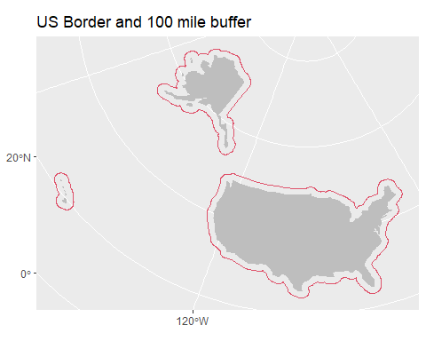<!-- -->

``` r
ggplot()+
  geom_sf(data=world%>%
            subset(subregion=="Northern America")%>%
            st_transform(.,Proj_AEA_Can),
          col=0)+
  geom_sf(data=can_cdiv,
          aes(fill=log10(popdens.sqkm)),
          col="transparent")+
  geom_sf(data=USA_buf,col=2,fill="transparent")+
  theme_void()+
  geom_point(data=CAcities,aes(x=X,y=Y,size=pop_max))+
  coord_sf(xlim = extent(can_cdiv)[1:2],ylim = extent(can_cdiv)[3:4])+
  ggtitle("Canadian Census Divisions and Population Density")+
  scale_fill_gradient(name=expression(paste("Population ",km^-2)),
                      low="darkblue",high="red",na.value="darkblue",
                      limits=c(-1.2,3.5),breaks=c(-1:3),labels=(10^c(-1:3)))
```

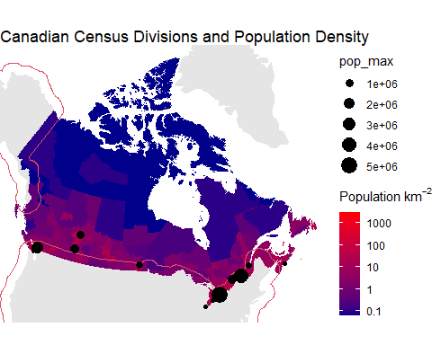<!-- -->

We can see that the region within 100 miles of the US border is highly
populated, but there are cities like Calgary, Edmonton, Halifax, and
Saskatoon that are north of this boundary.

### Use st_intersection to extract census tracts

We use st_intersection to intersect the buffered US border polygon and
Canadian census tracts. We make the assumption that population is evenly
distributed within census divisions, allowing us to adjust the size of
intersected tracts for their new clipped size. Inspecting their new
calculated areas, we see that many tracts are completely within the 100
mile buffer, but others have a much lower area.

``` r
intersect=st_intersection(
  can_cdiv,
  USA_buf
  )%>%
  mutate(area_km2 = st_area(.) %>% # calculate new shape areas
           as.numeric()*(1000^-2) # convert from sq m to sq km
         )
ggplot(data=intersect)+
  geom_point(aes(y=area_km2,x=landarea.sqkm))+
  scale_y_log10()+scale_x_log10()+
  geom_abline(intercept=0,slope=1)
```

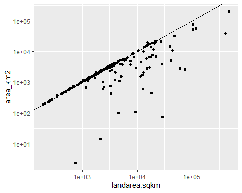<!-- -->

We recalculate a portion of the census tract population living only
within the portion within the 100 mile buffer. Our final calculation
finds that 27.3 million people live within 100 miles of the US border,
or 77.6% of the population. When we plot the intersect shapefile, we see
that we’ve actually clipped the census divisions to align with the
border, like the center of a Venn Diagram.

``` r
intersect$pop_2016_intersect=intersect$area_km2*
  intersect$popdens.sqkm
paste0(round(sum(intersect$pop_2016_intersect)*10^-6,1)," million people")
```

    ## [1] "27.3 million people"

``` r
print(paste0(round(100*sum(intersect$pop_2016_intersect,na.rm=TRUE)/
                     sum(can_cendat$pop.16,na.rm=TRUE),1),
             "% of population within 100 miles of the US border"))
```

    ## [1] "77.6% of population within 100 miles of the US border"

``` r
plot=ggplot()+
  geom_sf(data=can_cdiv,fill="gray",col="transparent")+
  geom_sf(data=intersect,
          aes(fill=log10(popdens.sqkm)),
          col="transparent")+
  geom_sf(data=can_prov,fill="transparent",col=1)+
  ggtitle("Population of Canada within 100 miles of the US border")+
  scale_fill_gradient(name=expression(paste("Population ",km^-2)),
                      low="darkblue",high="red",na.value="darkblue",
                      limits=c(-1.2,3.5),breaks=c(-1:3),labels=(10^c(-1:3)))+
  theme_void()
ggsave(plot,filename = "images/BufferPopDens.png",
       width = 5,height=4,dpi=300,units="in")
plot
```

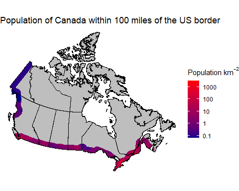<!-- -->

## What about Canada’s population in relation to some US city? Seattle?

We’ll practice creating a new shapefile from scratch. We’ll create a
data.frame describing points along a box with its top edge at 47.6
degrees north: the coordinates of Seattle. Then we’ll use functions from
the sf package to convert the dataframe into a shapefile

### Create a new shapefile

To create a point shapefile, we feed our coordinates (always x first, or
longitude) to a dataframe, and then to st_as_sf, specifying the CRS as
longitude and latitude (4326). More complicated, for a polygon, we want
to create 4 lines of a box that will form below the latitude of Seattle.
If we examine df, we see that we’ve created a sequence of points
rotating clockwise around this box, with the final point repeated from
the first row, as indicated by the arrows.

``` r
seattle.point=data.frame(lon=-122.33,lat=47.6) %>%
  st_as_sf(.,coords=names(.),crs = 4326) %>% 
  st_transform(.,Proj_AEA_Can)

lon=seq(-140,-45,2)
df=data.frame(
  lon=c(lon,rev(lon)),
  lat=c(rep(c(47.6,30),each=length(lon)))) %>%
  rbind(., .[1,])

ggplot(data=df,aes(x=lon,y=lat))+
  geom_path(arrow=arrow(ends="both",type = "closed"))+geom_point()
```

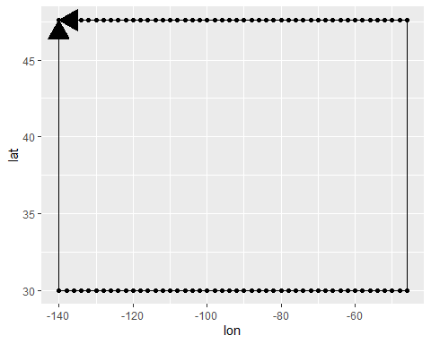<!-- -->

Next, we need to feed df to a complex sequence of equations, but most
importantly at the end we see us defining the CRS as latlong, and then
transforming the data to Canada Albers. With the map we see the
importance of specifying many points along the top of the box, to
achieve the curved shape of a single latitude band, while the vertical
(N-\>S) lines stay straight.

``` r
seattle=df %>% 
  as.matrix()%>%
  list()%>%
  st_polygon()%>%
  st_sfc()%>%
  st_sf(., crs = 4326)%>%
  st_transform(.,Proj_AEA_Can)

ggplot()+geom_sf(data=USA)+geom_sf(data=seattle,col=2,fill="transparent")
```

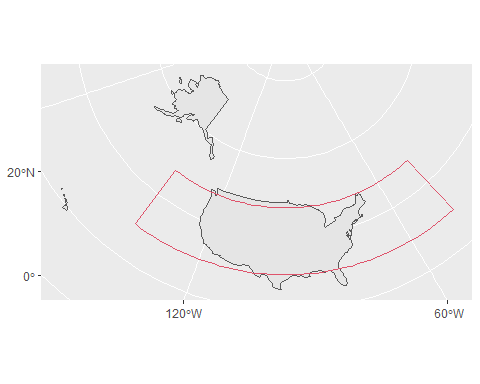<!-- -->

### Calculate

``` r
intersect=st_intersection(seattle,can_cdiv)%>%
  mutate(area_km2 = st_area(.) %>% as.numeric()*1000^-2)
intersect$pop_2016_intersect=intersect$area_km2*
  intersect$popdens.sqkm
paste0(round(sum(intersect$pop_2016_intersect)*10^-6,1)," million people")
```

    ## [1] "23.3 million people"

``` r
print(paste0(round(100*sum(intersect$pop_2016_intersect,na.rm=TRUE)/
                     sum(can_cendat$pop.16,na.rm=TRUE),1),
             "% of population south of Seattle, Washington State"))
```

    ## [1] "66.2% of population south of Seattle, Washington State"

``` r
ggplot()+
  geom_sf(data=can_cdiv,fill="gray",col="transparent")+
  geom_sf(data=intersect,
          aes(fill=log10(popdens.sqkm)),
          col="transparent")+
  geom_sf(data=seattle,col=2,fill="transparent")+
  geom_sf(data=can_prov,fill="transparent",col=1)+
  coord_sf(xlim = extent(can_cdiv)[1:2],ylim = extent(can_cdiv)[3:4])+
  ggtitle("Population of Canada south of Seattle, Washington")+
  scale_fill_gradient(name=expression(paste("Population ",km^-2)),
                      low="darkblue",high="red",na.value="darkblue",
                      limits=c(-1.2,3.5),breaks=c(-1:3),labels=(10^c(-1:3)))+
  theme_void()
```

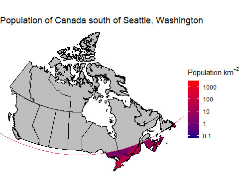<!-- -->
